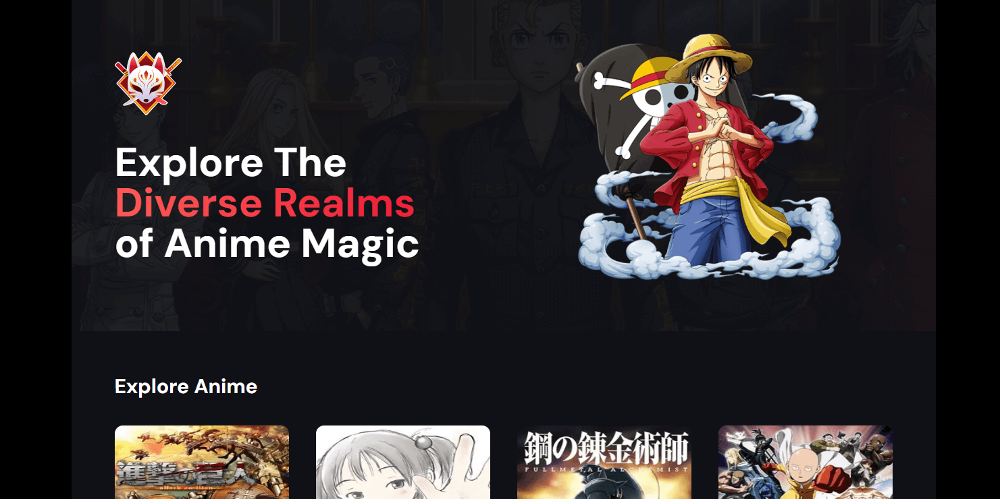

# Description

This project is a fictional anime streaming page built **using Next.js**, leveraging its powerful server-side rendering and routing capabilities for an optimized user experience. The application features **smooth animations created with Framer Motion**, enhancing interactivity and visual appeal. Additionally, it implements an **infinite scroll functionality**, allowing seamless content browsing without interruptions. With its sleek design and dynamic features, this project aims to deliver a modern and immersive interface inspired by popular streaming platforms.

# Main Features
- Next.js
- Framer Motion
- Infinite Scroll
- Responsive design

# Screenshot

